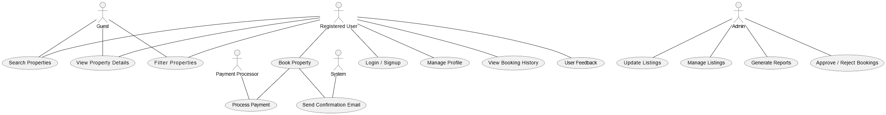

# Requirement Analysis in Software Development  

## Introduction  
This repository is dedicated to documenting the Requirement Analysis process for software development projects. It covers key methodologies, principles, and best practices involved in gathering, analyzing, and documenting requirements. By exploring practical tasks, this repository aims to provide a foundational understanding of how to create a blueprint for successful project execution.  

## What is Requirement Analysis?  

Requirement Analysis is a critical phase in the software development lifecycle (SDLC) where the needs and expectations of stakeholders are identified, analyzed, and documented to define what the software system must achieve. This process ensures all parties have a shared understanding of the project goals, scope, and requirements.  

### Importance in SDLC:  
1. **Clarity and Understanding:**  
   Requirement Analysis helps eliminate ambiguity by defining precise system objectives and functionality.  

2. **Scope Definition:**  
   Clearly outlining the scope ensures the project stays on track, preventing scope creep and unnecessary delays.  

3. **Foundation for Design and Development:**  
   Well-defined requirements serve as a blueprint for the design and development phases, ensuring alignment with user needs.  

4. **Accurate Cost and Time Estimation:**  
   By understanding the requirements upfront, project teams can estimate costs, resources, and timelines more accurately.  

5. **Quality Assurance:**  
   Validated requirements ensure the final product meets stakeholder expectations, enhancing user satisfaction and reducing rework.  

## Why is Requirement Analysis Important?  

Requirement Analysis plays a pivotal role in ensuring the success of software development projects. Here are three key reasons why it is critical in the SDLC:  

1. **Clarity and Alignment:**  
   - Requirement Analysis establishes a clear understanding of what stakeholders expect from the system.  
   - It reduces ambiguity and ensures that all team members are aligned with the project goals and objectives.  

2. **Prevents Scope Creep:**  
   - By clearly defining the project scope, Requirement Analysis minimizes the risk of unplanned changes that can lead to delays, budget overruns, or missed deadlines.  

3. **Ensures High-Quality Deliverables:**  
   - It provides a foundation for designing and building systems that meet user needs effectively.  
   - Validated requirements help ensure that the final product satisfies customer expectations and performs as intended.  

## Key Activities in Requirement Analysis  

Requirement Analysis involves several crucial activities that ensure the project's success by defining and validating its objectives. Here are the five key activities:  

- **Requirement Gathering:**  
  - Conduct interviews with stakeholders to understand their needs and expectations.  
  - Use surveys, questionnaires, and workshops to gather detailed requirements.  
  - Observe end-users in their work environments to gain insights into their challenges and workflows.  

- **Requirement Elicitation:**  
  - Facilitate brainstorming sessions to generate ideas and refine requirements.  
  - Organize focus groups with selected stakeholders to gather in-depth feedback.  
  - Create prototypes to help stakeholders visualize the system and refine their expectations.  

- **Requirement Documentation:**  
  - Develop a Requirement Specification Document to detail all functional and non-functional requirements.  
  - Write user stories to describe functionalities from the user’s perspective.  
  - Create use case diagrams to visually represent interactions between users and the system.  

- **Requirement Analysis and Modeling:**  
  - Prioritize requirements based on importance and feasibility.  
  - Conduct feasibility analyses to assess technical, financial, and time constraints.  
  - Develop models such as data flow diagrams (DFDs) or entity-relationship diagrams (ERDs) to visualize and analyze requirements.  

- **Requirement Validation:**  
  - Review the documented requirements with stakeholders to ensure accuracy and completeness.  
  - Define acceptance criteria for each requirement to guarantee alignment with project goals.  
  - Establish traceability matrices to ensure all requirements are addressed during development and testing.  

## Types of Requirements  

In software development, requirements can be broadly categorized into two types: Functional and Non-functional. Both are crucial for the system's success.  

### Functional Requirements  

Functional Requirements describe what the system should do. They define specific behaviors, features, or functions of the system.  

**Examples for the Booking Management System:**  
- **Search Properties:**  
  - Users should be able to search for properties based on criteria such as location, price, and availability.  
- **User Registration and Authentication:**  
  - New users should be able to create accounts, while existing users can log in securely.  
- **Property Listings:**  
  - The system should display properties with details such as price, location, and amenities, along with images.  
- **Booking System:**  
  - Users should be able to book properties, view booking details, and manage their bookings.  
- **Payment Processing:**  
  - The system should support secure online payment methods.  

### Non-functional Requirements  

Non-functional Requirements describe how the system should perform and outline system attributes such as usability, reliability, performance, and scalability.  

**Examples for the Booking Management System:**  
- **Performance:**  
  - The system should load pages within 2 seconds, even during peak traffic.  
- **Security:**  
  - Ensure user data is encrypted and protected against common vulnerabilities such as SQL injection and cross-site scripting.  
- **Scalability:**  
  - The system should handle up to 1000 concurrent users and allow for future expansion.  
- **Usability:**  
  - The interface should be intuitive, enabling users to complete booking tasks within three clicks.  
- **Reliability:**  
  - Maintain an uptime of 99.9% with quick recovery from failures.  

## Use Case Diagrams  

Use Case Diagrams visually represent the interactions between system actors and the functionalities they perform.  

### What are Use Case Diagrams?  
Use Case Diagrams illustrate the relationships between users (actors) and the system’s functionalities (use cases). They help in identifying system requirements and visualizing user interactions.  

### Benefits of Use Case Diagrams  
- **Clarity:** Simplifies complex system interactions into an easy-to-understand format.  
- **Communication:** Bridges the gap between stakeholders and developers by providing a shared understanding.  
- **Requirement Validation:** Ensures all functionalities and user interactions are considered.  

### Example Use Case Diagram for the Booking Management System  
Below is a use case diagram illustrating the interactions in the booking management system:  

  

**Actors:**  
- Guest: Searches properties and views listings.  
- Registered User: Books properties and manages bookings.  
- Admin: Manages property listings and handles system configurations.  

**Use Cases:**  
- Search Properties  
- View Listings  
- Book Property  
- Manage Bookings  
- Manage Listings  
- User Authentication  
